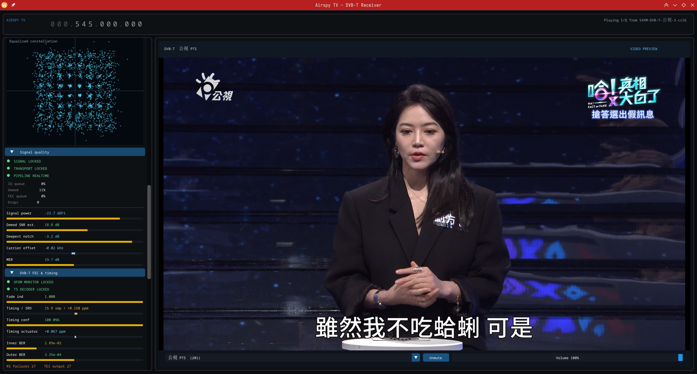

# Airspy TV

Airspy TV is a standalone C++20 DVB-T receiver that turns live SDR or recorded
I/Q samples into watchable television. It includes a native DVB-T decoder,
real-time RF diagnostics, service selection, a now/next EPG guide, embedded
libmpv playback, and raw I/Q/MPEG-TS recording in one application.



The current receiver can lock and play clean 6 MHz Taiwanese DVB-T captures
from an Airspy R2, including automatic TPS parameter discovery and
PAT/PMT/SDT-based channel selection. The native decoder and GUI share the same
processing path used by the command-line I/Q-to-TS tool.

## Project vision

Airspy TV's goal is a standalone terrestrial broadcast decoder with the Airspy
R2 as a first-class SDR: one application that turns the R2's I/Q stream into
watchable television without external demodulators or signal-processing tools.
DVB-T is the implemented standard; DVB-T2, DTMB, ATSC, and analog
(NTSC/PAL/SECAM), plus DVB-C, are documented long-term targets in the
[ROADMAP](ROADMAP.md). Decoding, TS/PSI/SI/EPG parsing, recording, and playback
all run in-process, so GNU Radio appears only as an offline test fixture.

## Highlights

- Native Airspy R2/Mini support through libairspy, including sensitivity and
  linearity gain profiles, Bias-T control, and dropped-sample reporting.
- Generic SDR support through SoapySDR for compatible devices with sufficient
  sample rate and usable bandwidth.
- Live 4096-bin spectrum and waterfall with Blackman-Harris windowing, FFT
  smoothing, adjustable dBFS range, and selectable tinycolormap palettes.
- Live DVB-T constellation, signal power, CP SNR, MER, deepest-notch estimate,
  carrier offset, pre-/post-Viterbi BER, and decoder/CPU queue diagnostics.
- Native 2K/8K DVB-T demodulation with QPSK, 16-QAM, 64-QAM, all
  non-hierarchical code rates, soft Viterbi, and RS(204,188) decoding.
- BCH-validated TPS discovery of transmission mode, guard interval,
  constellation, and high-priority code rate, with manual overrides for
  testing.
- Embedded libmpv video/audio playback rendered into the application OpenGL
  surface, with service selection, volume, and mute controls.
- Sidebar EPG now/next guide for the selected service, decoded from EIT
  present/following and TDT/TOT clock data with iconv-based DVB text support
  (Big5, GB2312, EUC-KR, ISO-8859-x, and the Taiwan mislabeled-UTF-16 quirk).
- Raw CS16 I/Q and full-multiplex MPEG-TS recording with duration, size,
  throughput, and drop telemetry.
- Real-time replay of application sidecars and raw `airspy_rx` INT16_IQ files.
- Decoder-paced offline I/Q-to-MPEG-TS extraction without realtime throttling
  or file-input drops.

## Current status

The end-to-end path is operational for clean, centered DVB-T signals:

```text
Airspy / SoapySDR / CS16 file
        -> native DVB-T OFDM + FEC decoder
        -> MPEG transport stream
        -> service selection
        -> libmpv video and audio
```

Clean and multipath 557/581 MHz Airspy recordings recover valid transport
streams and play in the GUI. The 151.6-minute 545 MHz replay is the current
long-run timing baseline: sample-clock tracking remains bounded and TS output
continues past the point where the earlier timing loop failed. EIT
present/following data drives the selected service's now/next guide.

Hierarchical DVB-T and captured long-delay/SFN validation remain unfinished.
DVB-T2 and the other roadmap standards are not implemented.

## Build

Required system libraries:

- SDL3 and OpenGL
- libairspy and SoapySDR
- libmpv and Fontconfig
- FFTW3f
- a C++20 compiler and CMake 3.25 or newer

Dear ImGui, nlohmann/json, tinycolormap, liquid-dsp, and ViterbiDecoderCpp are
pinned under `contrib/` as Git submodules. The minimized libfec Reed-Solomon
subset is vendored directly under `contrib/libfec`.

```sh
git submodule update --init --recursive
cmake -S . -B build -DCMAKE_BUILD_TYPE=Debug
cmake --build build
./build/airspy-tv
```

Debug builds default to `-O3 -g -DNDEBUG`, retaining debugger symbols while the
optimized DSP and Viterbi paths run at Release-like speed. Configure with
`-DAIRSPY_TV_OPTIMIZED_DEBUG=OFF` for an assertion-enabled, unoptimized Debug
build.

Builds also default to `-march=native`. Use
`-DAIRSPY_TV_NATIVE_ARCH=OFF` when producing a portable binary for a different
CPU. The default soft-Viterbi backend is ViterbiDecoderCpp's AVX2-u16
implementation when the compiler target supports AVX2, with SSE4.1 and AArch64
NEON selected on suitable targets and a scalar backend used otherwise.
Configure with `-DAIRSPY_TV_USE_SIMD_VITERBI=OFF` to force the scalar backend.

## Using the receiver

The Source panel exposes the decoder worker budget and available input sources.
Open a native Airspy, a compatible SoapySDR device, or an I/Q recording, then:

1. Select the DVB-T channel bandwidth (5, 6, 7, or 8 MHz).
2. Tune the always-centered frequency control; the mouse wheel changes the
   digit currently under the pointer.
3. Leave DVB-T mode parameters on Auto for TPS discovery, or set them manually
   for diagnostics.
4. Wait for OFDM and TS lock, then choose a service in the video footer.
5. Adjust volume or mute playback, and optionally record raw I/Q or the full
   MPEG transport stream. The EPG sidebar panel follows the selected service
   and shows its current and next programs.

The service selector filters playback to the selected service's PMT, PCR,
audio, and video PIDs while retaining required PSI/SI packets. MPEG-TS recording
intentionally writes the complete MPTS rather than only the selected service.

## I/Q files and recording

Application recordings use raw interleaved little-endian signed 16-bit I/Q
(`ci16_le`). Stopping a recording writes a JSON sidecar beside the sample data.
It records the data filename, sample rate, center frequency, source, duration,
sample count, and drop counters.

The sidecar and data file must remain in the same directory. Open the JSON file
from the Source panel and Airspy TV resolves the data filename from its
metadata. Bare `.cs16` and `.iq` files are also supported and use the
INT16_IQ layout produced by `airspy_rx -t 2`; specify their sample rate and
center frequency manually.

| Input | Metadata | Playback behavior |
|---|---|---|
| Airspy native | Device/driver supplied | Live |
| SoapySDR | Device/driver supplied | Live |
| Airspy TV `.json` sidecar | Sample rate, center frequency, data filename | Real time |
| Bare `.cs16` / `.iq` | Enter sample rate and center frequency manually | Real time |

The raw I/Q recorder has a five-second queue and the full-MPTS recorder has an
independent 24 MiB write queue. DSP queues retain approximately 200 ms of their
respective streams to tolerate ordinary scheduler jitter; RF input remains
non-blocking because live hardware cannot accept backpressure. The separate
mpv queue has an 8 MiB capacity, enters buffering below 1 MiB, and resumes at
2 MiB so a short decoder dropout does not immediately become playback
stutter.

## Command-line tools

List visible SDR devices without starting the GUI:

```sh
./build/airspy-tv --enumerate
```

Run a short source/recorder diagnostic using the first native Airspy, falling
back to the first SoapySDR device:

```sh
./build/airspy-tv --record-first /tmp/airspy-tv-smoke.cs16 --duration 250
```

Inspect a sidecar or bare I/Q file without starting the GUI:

```sh
./build/airspy-tv --inspect-iq capture.cs16.json
./build/airspy-tv --inspect-iq airspy-rx-output.iq \
  --sample-rate 10000000 --frequency 545000000
```

Decode finite I/Q input to MPEG-TS as quickly as the CPU permits:

```sh
./build/airspy-tv --decode-iq capture.cs16.json --ts-output output.ts
./build/airspy-tv --decode-iq airspy-rx-output.iq \
  --ts-output output.ts --sample-rate 10000000
./build/airspy-tv --decode-iq capture.cs16.json \
  --ts-output output.ts --decoder-threads 8
./build/airspy-tv --decode-iq capture.cs16.json \
  --ts-output output.ts --debug
```

JSON input uses the same sidecar resolver as the GUI. A sample rate is only
needed for bare INT16_IQ files; pass it with `--sample-rate HZ`. Offline
decoding uses blocking submission and does not drop input when the decoder is
slower than the file reader.

The decoder worker budget defaults to `std::thread::hardware_concurrency()`.
`--decoder-threads N` overrides it; the same option appears in the GUI and is
fixed while a source is open. `0` selects the automatic default. The DVB-T
transmission parameters (`--dvbt-mode`, `--dvbt-channel-bandwidth`,
`--dvbt-guard`, `--dvbt-modulation`, `--dvbt-code-rate`) default to
auto-detection from the TPS and can be forced when the signal is marginal or
the capture metadata is incomplete. Pass `-d` or `--debug` to include worker
allocation, per-stage timings, tracking events, and detailed FEC diagnostics.

## Decoder architecture

<details>
<summary>Native DVB-T processing pipeline</summary>

The shared GUI/CLI decoder is a continuous bounded pipeline. A frontend thread
converts and resamples CS16 input into an absolute-position sample ring. The
serial demod thread owns acquisition, FFT-window position, carrier and timing
loops, channel state, TPS, and symbol order.

Independent symbol postprocessing is dispatched to a worker pool and rejoined
by sequence. A separate FEC thread sends overlapping mother-code windows to
the Viterbi pool, performs another ordered join, then serializes convolutional
byte deinterleaving, RS(204,188), energy descrambling, and MPEG-TS output. The
soft Viterbi stage uses the best compile-time ViterbiDecoderCpp backend, with a
portable scalar fallback. A minimized libfec subset provides RS(204,188).

There are no per-chunk decoder seams or packet-overlap joins. Generation-tagged
reset and retune handling suppress stale worker results before they can reach
stateful FEC or output sinks. Live sources drop and report an input block on
overload; offline decoding applies backpressure instead.

See [docs/worker-pools-and-dataflow.md](docs/worker-pools-and-dataflow.md) for
thread, queue, ordering, and reset details. Clock-tracking experiments and
remaining validation are maintained in
[docs/clock-tracking.md](docs/clock-tracking.md).

</details>

## Reproducible test signal

An offline GNU Radio reference transmitter generates a deterministic ideal
6 MHz, 8K, guard-1/4, 64-QAM, rate-2/3 fixture. This helper requires GNU
Radio's Python bindings, NumPy, and FFmpeg, but they are not application runtime
dependencies.

```sh
XDG_CACHE_HOME=/tmp/airspy-tv-gnuradio-cache \
  python3 tools/generate_dvbt_fixture.py /tmp/airspy-tv-ideal.cs16
cmake -S . -B build-release -DCMAKE_BUILD_TYPE=Release
cmake --build build-release --target airspy-tv
./build-release/airspy-tv --decode-iq \
  /tmp/airspy-tv-ideal.cs16.json --ts-output /tmp/airspy-tv-ideal-native.ts
```

The generator writes an application-compatible JSON sidecar and the
unmodulated source stream as `airspy-tv-ideal.expected.ts`. The current ideal
regression deterministically recovers packet-aligned TS with a valid PAT and
PMT.

Sample-clock and LO impairments can be injected independently. Offsets set the
initial error; drift rates change that error linearly over the fixture:

```sh
XDG_CACHE_HOME=/tmp/airspy-tv-gnuradio-cache \
  python3 tools/generate_dvbt_fixture.py /tmp/airspy-tv-drift.cs16 \
    --duration 120 \
    --sample-clock-ppm 1.5 \
    --sample-clock-drift-ppm-per-minute 0.2 \
    --lo-offset-hz 750 \
    --lo-drift-hz-per-minute -25
```

The JSON sidecar records all four impairment parameters while retaining the
nominal 10 MS/s sample rate expected by the decoder.

Run the end-to-end clock regression to generate and decode sample-clock-only,
LO-only, and independent sample/LO drift fixtures:

```sh
python3 tools/validate_dvbt_clock_drift.py \
  --build-dir build \
  --duration 20
```

By default, generated fixtures, decoder logs, and transport streams use a
temporary directory that is removed after the run. Pass `--work-dir PATH` to
retain those artifacts for inspection. The validator checks the recovered SRO
and CFO independently, requires non-empty TS output, and rejects timing/FEC
failure events.
