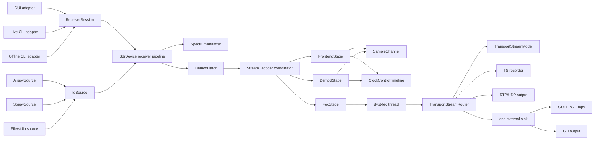

# Architecture and Refactor Review

Date: 2026-08-09
Maintained against: current worktree based on `09afaba`

## Scope

This review reassesses the source tree after the DVB-T timing, FEC, reporting,
live-input, RTP, and validation work. It focuses on ownership, dependency
direction, code reuse, and a refactor order that preserves the now-stable DSP
behavior. It is intentionally separate from the remaining soundness findings
in [architecture-review-2026-08-06.md](architecture-review-2026-08-06.md).

The audit covered the CMake target graph, public headers, all application and
DVB-T translation units, the report and output paths, GUI state ownership, the
CTest suite, and the checked-in validation workflow.

## Baseline

The non-vendored `src/` and `include/` production tree currently contains
20,671 code lines according to `cloc` (16,489 C++ implementation lines and
4,182 C/C++ header lines). The most relevant physical sizes are:

| Area                                                     |         Current size | Observation                                                                                                                                          |
| -------------------------------------------------------- | -------------------: | ---------------------------------------------------------------------------------------------------------------------------------------------------- |
| DVB-T coordinator and explicit pipeline stages           | 6,000 physical lines | `StreamDecoder::Impl` is 518 lines; frontend, demod, FEC, sample transport, and clock control have independent owners and normal translation units |
| `src/decode_report.cpp`                                |          1,261 lines | Report lifecycle, aggregation, schema conversion, atomic JSON, and debug rendering                                                                   |
| `src/sdr.cpp` plus `src/iq_source.cpp`               |          1,319 lines | Source backends are separated from timeline, analysis, demodulation, and output ownership                                                            |
| `src/receiver_session.*` plus live/offline entry paths |            965 lines | GUI, live CLI, and offline CLI share the same receiver lifecycle and report helper                                                                   |
| `src/gui/*`                                            |          2,985 lines | Translation units are split, but panels still share one mutable`AppState`                                                                          |

The current baseline is healthy enough to support refactoring:

- optimized Debug, assertion Debug, portable Release, ASan/UBSan, and TSan pass
  all 27 current CTest cases after the Phase 4 ownership move;
- the current portable Release and ASan/UBSan binaries each pass all 480
  synthetic fixtures with exact transport and report validation after the
  Phase 4 stage extraction;
- the current TSan binary passes all 23 deterministic pairwise and high-load
  synthetic fixtures;
- the full CTest suite passes under TSan;
- a two-second stdin-I/Q to stdout/TS replay recovers 23,527 exact cyclic TS
  packets with zero TEI and a valid 639-record decode report;
- the retained real-signal baseline completed six cases, with five decoded and
  the intentionally weak capture classified as `no_transport`;
- no known unsafe data-flow failure was found in this review.

The stable behavior must be treated as a contract: generation cancellation,
sample-counter scheduling, exact symbol/FEC ordering, TS packet cadence, typed
discontinuities, report schema version `0`, and the current live overflow/drop
policies are all refactor invariants.

## Current topology

The effective runtime graph is:

`IqSource` owns backend handles, source workers, pacing, and backend error
translation. `SdrDevice` owns source selection, timeline stamping, optional
display analysis, demodulation, and transport outputs. GUI, live CLI, and
offline CLI all use `ReceiverSession`; `DecodeRunReporter` supplies the common
source-session, telemetry-drain, and report-finalization sequence. The adapters
retain only their event loop, output, and interrupt policies.

## Findings

### Medium: receiver-pipeline and transport ownership still converge in

`SdrDevice`

The source extraction removed backend handles and worker loops from
`SdrDevice`, display analysis can be disabled for CLI paths, and file pacing
plus decoder backpressure are now explicit policies. The class still owns the
selected `IqSource`, timeline, analyzer, demodulator, raw recorder, transport
model, TS recorder, RTP output, and router. This remains coherent as one
receiver pipeline, but transport ownership and observer execution are still
part of the same façade. Internal DVB-T stage ownership is now explicit, so
transport fanout can be the next independent ownership change.

### Medium: reporting has become a second large mode-specific coordinator

`src/decode_report.cpp` is 1,261 lines. Its `Impl` handles directory creation,
manifest creation, six homogeneous JSONL streams, source-session lifecycle,
telemetry conversion, aggregation, atomic `stats.json`, and finalization.
`format_debug_telemetry()` is in the same file and still contains an independent
large `std::visit` renderer. The typed record queue prevents worker-side JSON
work, which is sound, but the conversion and debug naming can still drift from
the internal representation as fields are added.

The report should be split into three ownership layers:

1. `DecodeRunReport`: common manifest, source-session lifecycle, final status,
   and file retention/flush rules;
2. `TelemetryStreamRouter`: batching and routing records to homogeneous JSONL
   writers, independent of DVB-T field names;
3. `dvbt_report_codec`: DVB-T record and snapshot serialization plus the
   human-readable debug renderer.

The codec should be the only place that knows the DVB-T JSON field mapping.
The common layer should retain the current mode field and report lifecycle,
without introducing a plugin registry or generic mode schema in advance of a
second implementation. Keep telemetry out of the standard-neutral
`Demodulator` interface, as the current design document correctly requires.

### Medium: transport fanout runs observers on the FEC output thread

`TransportStreamRouter::consume()` synchronously updates the service model,
submits recorder/RTP blocks, and invokes one external sink. The GUI external
sink then synchronously feeds both EPG parsing and mpv. This is bounded and
currently validated, but a slow observer or a future network sink can extend
the FEC critical path and distort the timing telemetry being used to optimize
the decoder.

The next transport abstraction should distinguish:

- required ordered sinks, which participate in completion/error policy;
- optional lossy sinks, which have their own bounded queue and drop counters;
- latest-state observers, such as service/EPG models.

The router should fan out immutable TS blocks to these explicit sink classes.
The current single `std::function` callback is a convenient compatibility
adapter, not a long-term ownership model.

### Medium: GUI is split by file but not by state ownership

The GUI has already removed the former 2,400-line monolithic translation unit.
The remaining 2,985 lines are reasonably divided by panel, so another blind
file split is not the right next step. Every panel receives the entire mutable
`AppState`, which contains source controls, decoder configuration, all
snapshots, output state, dialogs, EPG, mpv, report lifecycle, and SDL window
state.

First introduce a frame snapshot/view-model pass and group state into source,
display, standard, output, and reporting subobjects. Panel commands should use
small controller functions rather than directly orchestrating multi-step
operations such as report close -> retune -> report start. This will make GUI
tests possible without constructing SDL/mpv and will prevent a future DVB-T2
panel from depending on DVB-T fields in the common app state.

## Recommended refactor sequence

### Completed foundation: Phases 0-3

Source epochs and recorder failures have explicit tests. Production runtime
objects are built once in `airspy-tv-runtime`; CLI helpers are ordinary
translation units; tests link the production library. Airspy, SoapySDR, file,
and stdin backends now implement the private `IqSource` contract, while the
receiver pipeline owns timeline stamping and optional display analysis.
Lifecycle ordering stops and joins source callbacks before resetting or
replacing the demodulator. Offline decoding now uses `ReceiverSession`,
unpaced file/stdin input, blocking decoder submission, and
`DecodeRunReporter`; GUI and live CLI retain realtime/drop policies and their
own event loops. The optimized Debug, assertion Debug, portable Release,
ASan/UBSan, full TSan, stdin/stdout, report-reader, and complete synthetic gates
pass.

### Phase 4: real component boundaries inside DVB-T

Completed. `SampleChannel`, `ClockControlTimeline`, `FrontendStage`,
`DemodStage`, and `FecStage` now own their state, synchronization, and worker
lifecycle. Pure timing/notch/phase-lock operations live in `demod_dsp.cpp`;
frontend and demod workers compile as normal translation units rather than
textual implementation includes. `StreamDecoder::Impl` retains source
timeline fallback, stage construction and shutdown, external callbacks, and
terminal failure publication.

Current gate result: optimized Debug, assertion Debug, portable Release,
ASan/UBSan, and full TSan each pass 27/27 CTest cases. After the completed
ownership move, portable Release and ASan/UBSan each pass 480/480 synthetic
fixtures and TSan passes 23/23 deterministic pairwise fixtures. Their
independently validated machine-readable report contains 983 completed
fixtures and zero failures. Phase 4 is therefore closed; long real captures
remain post-change DSP and source validation rather than a structural
prerequisite for Phase 5.

### Phase 5: report codec boundaries

- Split common report lifecycle from DVB-T JSON conversion/debug rendering.
- Keep `mode`, stream schema version, sample coordinates, and source-session
  boundaries unchanged for report consumers.

Gate: JSONL reader validation, GUI report smoke, offline one-source report,
multi-source/retune report, and schema snapshot comparison.

### Phase 6: GUI state and transport observers

- Group `AppState`, introduce frame view models, and route panel commands
  through controller methods.
- Separate required sinks, lossy outputs, and latest-state observers in the TS
  fanout.
- Add GUI lifecycle tests only after the runtime layer is independent of SDL,
  ImGui, and mpv.

Gate: headless/runtime tests plus manual GUI/mpv validation.

## What should not be refactored yet

- Do not replace the working arbitrary resampler or change its filter/tap
  policy as part of structural cleanup.
- Do not retune the SRO/CFO loops, alter fixed sample-counter delays, or change
  queue watermarks while moving classes.
- Do not parallelize the stateful demodulator or FEC stage merely to reduce the
  size of a file. Their serial ownership is currently an important invariant.
- Do not create a generic all-standards statistics mega-struct. Share the
  report envelope and lifecycle, while keeping mode-specific payloads typed.
- Do not introduce a mode plugin/controller merely to remove typed DVB-T access
  from `ReceiverSession`. Its non-owning DVB-T pointer follows the lifetime of
  the installed demodulator and is an acceptable implementation detail. Add a
  shared abstraction only when a second standard exposes concrete duplicated
  behavior.
- Do not split GUI files further without first reducing `AppState` coupling.

## Immediate next actions

1. Separate the common report lifecycle/router from the DVB-T report codec.
2. Add the Phase 5 schema and multi-source report gates before changing the
   report implementation.
3. Continue with transport or GUI ownership only where profiling, tests, or a
   concrete second-standard implementation justify the boundary.

The safe unit of progress remains one ownership boundary with its validation
gate. The next useful boundary is report serialization; transport and GUI
state should follow concrete pressure, not a requirement for maximal standard
separation.
